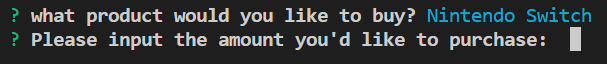
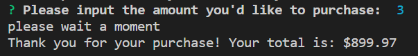

# bamazon

## Welcome to bamazon! A basic CLI node application. Let's get this started. 

Make sure to run the .sql file before proceeding. Once everything is set up, just run by typing the below.

When the app starts up, the products available for purchase will appear (I looked up random electronics products on Amazon).

The user is then prompted for the name of the product they wish to buy.

Upon selecting which product they'd like to buy, the customer is asked what quantity of the item they want to purchase.

The quantity desired is checked against the database and if there are enough available, the customer is shown the sales total, having purchased the items. 
